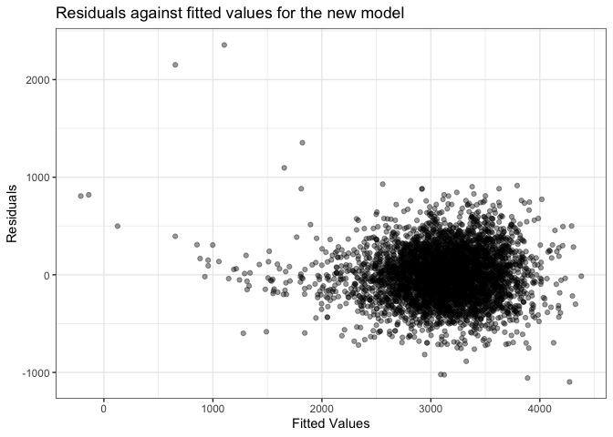
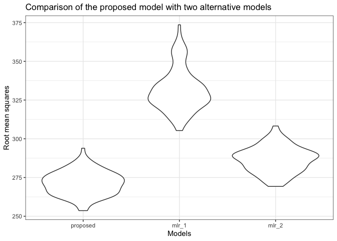
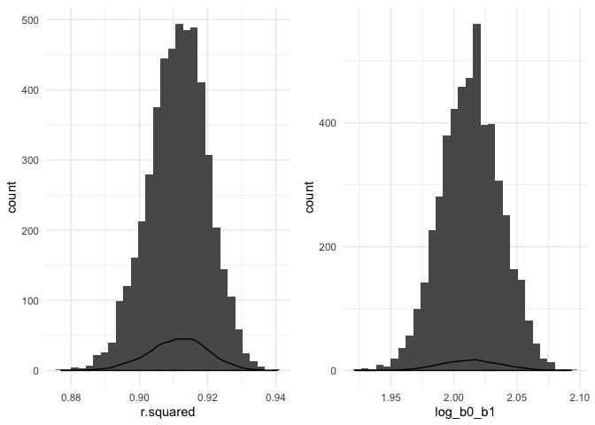

Homework 6
================
Harsha Senapathi
11/21/2019

The child birth weight data is imported and cleaned as follows.

``` r
child_data = read_csv("./data/birthweight.csv") %>% 
  janitor::clean_names() %>% 
  mutate(babysex = as.factor(babysex))%>% 
  mutate(frace = as.factor(frace))%>% 
  mutate(mrace = as.factor(mrace))%>% 
  mutate(malform = as.factor(malform)) %>% 
  mutate(parity = as.factor(parity)) %>% 
  select(-pnumlbw, -pnumsga) %>% 
  select(bwt, babysex, everything())
```

In the above chunk, the babysex, father’s race, mother’s race, presence
of malformations and parity are converted to factors. This is due to the
categorical nature of the variable. Previous number of low birth weight
babies and number of prior small for gestational age babies, i.e the
*pnumlbw* and *pnumsga* columns respectively, are dropped since they are
constant all through the data set and equal to 0.

Here we propose a regression model for the birthweight using *stepwise
regression* with *backward elimination*. This is a data driven model
building-process where the predictors that lower the AIC (Akaike
information criterion) the most from the starting AIC value are dropped
sequentially after each run. \# Using backward elimiantion to look for
preditors

``` r
fit_mlr_child_bwt = lm(bwt ~ ., data = child_data)

backward_elim_child_bwt_predictors =
  step(fit_mlr_child_bwt, direction = "backward") %>% 
  broom::tidy() %>% 
  knitr::kable()
# stepwise regression using backward elimination
```

The predictors finally chosen for our linear regression model
are:

|                                           |                           |                                                             |                                                   |                                                  |                                                   |                                                |                                                 |                                                  |                                                 |                                                     |                                                    |                                                     |                                                     |                                                     |                                                     |                                                |                                                  |
| :---------------------------------------- | :------------------------ | :---------------------------------------------------------- | :------------------------------------------------ | :----------------------------------------------- | :------------------------------------------------ | :--------------------------------------------- | :---------------------------------------------- | :----------------------------------------------- | :---------------------------------------------- | :-------------------------------------------------- | :------------------------------------------------- | :-------------------------------------------------- | :-------------------------------------------------- | :-------------------------------------------------- | :-------------------------------------------------- | :--------------------------------------------- | :----------------------------------------------- |
| term estimate std.error statistic p.value | ———— ————– ———— ———— ———- | (Intercept) -6097.7043334 137.5848037 -44.3196063 0.0000000 | babysex2 28.4982919 8.4568554 3.3698450 0.0007587 | bhead 130.7266516 3.4477458 37.9165573 0.0000000 | blength 74.9841630 2.0199050 37.1226183 0.0000000 | delwt 4.1092124 0.3921336 10.4791144 0.0000000 | fincome 0.3200529 0.1748024 1.8309413 0.0671780 | gaweeks 11.5773486 1.4638454 7.9088602 0.0000000 | mheight 6.5789862 1.7853204 3.6850450 0.0002315 | mrace2 -138.9299485 9.9109732 -14.0177907 0.0000000 | mrace3 -74.9088912 42.3213473 -1.7700025 0.0767971 | mrace4 -100.7047096 19.3280218 -5.2102957 0.0000002 | parity1 298.2465585 272.6444247 1.0939030 0.2740584 | parity3 210.4502088 272.6151286 0.7719682 0.4401754 | parity6 583.4559698 273.8308892 2.1307164 0.0331688 | ppwt -2.6762665 0.4274697 -6.2607157 0.0000000 | smoken -4.8477289 0.5857236 -8.2764783 0.0000000 |

Proposed regression model is:

``` r
new_fit_mlr_child_bwt = 
  lm(bwt ~ parity + fincome + babysex + mheight + ppwt + gaweeks + smoken + delwt + mrace + blength + bhead, data = child_data)

new_fit_mlr_child_bwt %>% 
  broom::tidy()
```

    ## # A tibble: 16 x 5
    ##    term         estimate std.error statistic   p.value
    ##    <chr>           <dbl>     <dbl>     <dbl>     <dbl>
    ##  1 (Intercept) -6098.      138.      -44.3   0.       
    ##  2 parity1       298.      273.        1.09  2.74e-  1
    ##  3 parity3       210.      273.        0.772 4.40e-  1
    ##  4 parity6       583.      274.        2.13  3.32e-  2
    ##  5 fincome         0.320     0.175     1.83  6.72e-  2
    ##  6 babysex2       28.5       8.46      3.37  7.59e-  4
    ##  7 mheight         6.58      1.79      3.69  2.31e-  4
    ##  8 ppwt           -2.68      0.427    -6.26  4.20e- 10
    ##  9 gaweeks        11.6       1.46      7.91  3.27e- 15
    ## 10 smoken         -4.85      0.586    -8.28  1.67e- 16
    ## 11 delwt           4.11      0.392    10.5   2.16e- 25
    ## 12 mrace2       -139.        9.91    -14.0   1.08e- 43
    ## 13 mrace3        -74.9      42.3      -1.77  7.68e-  2
    ## 14 mrace4       -101.       19.3      -5.21  1.97e-  7
    ## 15 blength        75.0       2.02     37.1   4.13e-262
    ## 16 bhead         131.        3.45     37.9   7.06e-272

Showing a plot of model residuals against fitted values using
add\_predictions and add\_residuals.

``` r
child_data %>% 
  add_predictions(new_fit_mlr_child_bwt) %>% 
  add_residuals(new_fit_mlr_child_bwt) %>% 
  ggplot(aes(x = pred, y = resid)) +
  geom_point(alpha = 0.4) +
  labs(
    title = "Residuals against fitted values for the new model",
    x = "Fitted Values", 
    y = "Residuals"
  )
```

<!-- -->

### Comparison of the above model with the following two models:

MLR\_1 : One using length at birth and gestational age as predictors
(main effects only)

MLR\_2 : One using head circumference, length, sex, and all interactions
(including the three-way interaction) between these

In the following code chunk, cross validation is carried out followed by
a plot to compare the spread of *root mean squares* in the three models.

``` r
set.seed(1)

fit_mlr_1 = lm(bwt ~ blength + gaweeks, data = child_data)
fit_mlr_2 = lm(bwt ~ bhead*blength*babysex, data = child_data) 
# multiple regression with interaction

cv_df = 
  crossv_mc(child_data, n = 100) %>% 
  mutate(train = map(train, as_tibble),
         test = map(test, as_tibble)) 

cv_df = cv_df %>% 
  mutate(proposed_mlr  = map(train, ~lm(bwt ~ parity + fincome + babysex + mheight + ppwt + gaweeks + smoken + delwt + mrace + blength + bhead, data = child_data)),
         mlr_1 = map(train, ~lm(bwt ~ blength + gaweeks, data = child_data)),
         mlr_2 = map(train, ~lm(bwt ~ bhead*blength*babysex, data = child_data))
  ) %>% 
  mutate(rmse_proposed  = map2_dbl(proposed_mlr,  test, ~rmse(model = .x, data = .y)),
         rmse_mlr_1 = map2_dbl(mlr_1, test, ~rmse(model = .x, data = .y)),
         rmse_mlr_2 = map2_dbl(mlr_2, test, ~rmse(model = .x, data = .y))
  )

cv_df %>% 
  select(starts_with("rmse")) %>% 
  pivot_longer(
    everything(), 
    names_to = "model",
    values_to = "rmse", 
    names_prefix = "rmse_") %>%  
  mutate(model =   fct_inorder(model)) %>% 
  ggplot(aes(x = model, y = rmse)) + geom_violin() + 
  labs(
    title = "Comparison of the proposed model with two alternative models",
    x = "Models", 
    y = "Root mean squares"
  )
```

<!-- -->

The proposed model using backward elimination stepwise regression is the
clear winner here with the highest prediction accuracy. We see that the
first suggested alternative bwt ~ blengths + gaweeks has the largest
RMSE while the other suggested model is lower but still larger than the
proposed model.

# Problem 2

Importing data

``` r
weather_df = 
  rnoaa::meteo_pull_monitors(
    c("USW00094728"),
    var = c("PRCP", "TMIN", "TMAX"), 
    date_min = "2017-01-01",
    date_max = "2017-12-31") %>%
  mutate(
    name = recode(id, USW00094728 = "CentralPark_NY"),
    tmin = tmin / 10,
    tmax = tmax / 10) %>%
  select(name, id, everything())
```

Creating values for

``` r
results = weather_df %>% 
  modelr::bootstrap(n = 5000) %>% 
  mutate(
    models = map(strap, ~ lm(tmax ~ tmin, data = .x)),
    results = map(models, broom::tidy),
    glance = map(models, broom::glance)) %>% 
  select(results, glance, .id) %>% 
  unnest(results) %>% 
  pivot_wider( 
    names_from = term,
    values_from = c(estimate, std.error, glance),
    id_cols = .id, 
    ) %>%
  janitor::clean_names() %>%
  mutate(
    log_b0_b1 = log(estimate_intercept * estimate_tmin)
  ) %>%
  unnest(c(glance_intercept))
```

``` r
results %>% 
  pull(r.squared) %>% 
  quantile(c(0.025, 0.975)) %>% 
  knitr::kable(col.names = "R.squared")
```

|       | R.squared |
| ----- | --------: |
| 2.5%  | 0.8936977 |
| 97.5% | 0.9274807 |

The above table shows the 95% CI for R-squared

``` r
results %>% 
  pull(log_b0_b1) %>% 
  quantile(c(0.025, 0.975)) %>% 
  knitr::kable(col.names = "Coeffcient")
```

|       | Coeffcient |
| ----- | ---------: |
| 2.5%  |   1.966942 |
| 97.5% |   2.058528 |

The above table shows the 95% CI for log\_b0\_b1

``` r
r.squared = results %>% 
  ggplot(aes(x = r.squared)) + 
  geom_histogram() + 
  geom_density() +
  theme_minimal() 
log_b0_b1 = results %>% 
  ggplot(aes(x = log_b0_b1)) + 
  geom_histogram() + 
  geom_density() +
  theme_minimal()
r.squared + log_b0_b1
```

<!-- -->

We can observe the histograms plotted above for Variance and log of
intercept are normally distributed. The mean of r-squared is 0.9112686
and mean for log\_b0\_b1 is 2.0132792.
